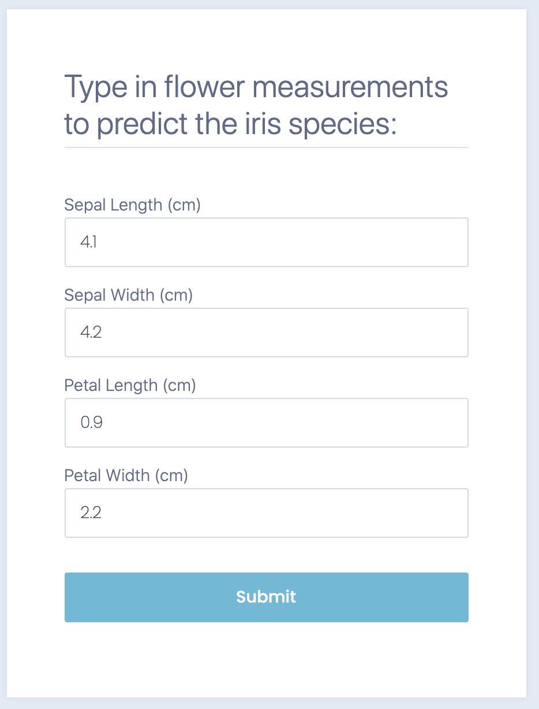
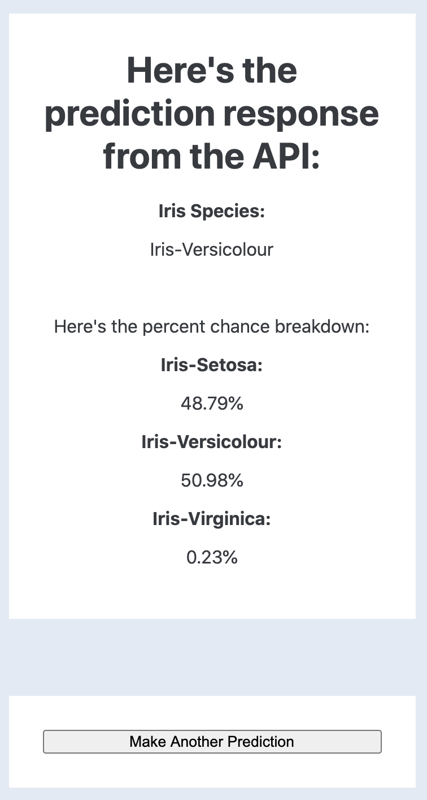

# Serving a simple ML model in a REST API using Flask, Flask-RESTful and Docker-Compose

## Background:
I come from the world of client facing Analytics and Data Science in the capacity of analyzing datasets and presenting results to clients on an ad-hoc basis. While this is certainly has it's value and serves a need within many businesses, my personal interest is within serving and deploying Machine Learning models to provide predictive intelligence to software applications. My career goal is to move into this type of work; however, my problem is that I haven't had job experience deploying ML models nor have I worked with any colleagues that have deployed ML models. So I set out with a goal of reaching out to other ML Engineers and Full Stack Data Scientists to learn from them and understand how typically ML models are deployed and with this knowledge, learn up on the technologies used and build a working example of my own.

This project represents my first simple proof of concept of how ML models can be deployed in industry. The ML model I'm using here is trained on the very simple well known iris dataset from sklearn. I did this to place emphasis on the surrounding architecture of deployment as well as to publish a working concept before I create something more intellectually interesting. I have a much more interesting project in mind that I'll be working on next to integrate into this same type of ML deployment architecture, but for now, this project serves as my first proof of concept of ML deployment.

## The Architecture:
- I'm serving this simple ML model with a REST API using the Flask-RESTful library. Prediction data is sent to the API in the query parameters of a GET request. The API then receives this prediction data and feeds it into a trained ML classifier model to get a prediction. This prediction is then sent back in JSON format to the requesting client. The API also uses a basic authentication consisting of a username and password.
- In this project, I decided to also include what I'm calling a 'front end' app that was built using Flask. This web app's function is to make GET requests to the API through a simple form and render the API's prediction response in a separate URL.
- These two services are separately packaged in their own Docker containers to make for easy deployment on any system and to abstract the need to manually install dependencies. Then in order for these two containers to communicate via HTTP, they're made to share the same internal network within docker. All of this is achieved with Docker-Compose, a tool that builds and launches multiple containers on the same internal network with a simple file (called: docker-compose.yml) and a complementary terminal instruction: $ docker-compose up.
- Each container for both the API and front end app have ports that are published locally (8000 and 5000 respectively) so you can both connect to the web app in a browser or manually send a GET request to the API on your local machine.

## Folder Contents:

### API:
This folder contains the python script for the API as well as a separate script for building the classifier model trained on the simple iris dataset. There are also docker files that instruct docker how to build the api container and which dependencies are needed.

#### API Structure:
- Authentication: Is basic authentication with a simple password and username.
- Request method: Prediction data is sent to API with a GET request with the prediction data in the query parameters.

### Front_End_App:
This folder contains the python scripts for creating the flask app that communicates with the REST API and renders the results. Also included is the docker build files.

### Tests
This folder contains separate testing folders for unit tests on the api and front_end_app.

## Instructions:
0. Download [docker](https://docs.docker.com/get-docker/) and if you're using Linux download [docker-compose](https://docs.docker.com/compose/install/) separately.
1. In the root directory, run "$ docker-compose up" (Where the file docker-compose.yml is located).
    - This command will build both the api and front end app containers separately, connect them both to the same network within docker so they can communicate through HTTP requests and run them.
2. In a browser go to: http://localhost:5000/.
    - This will display the front end app and when you enter in the iris flower measurements into the form, the app will make a GET request to the API containing this data and the returned response will render the API's iris species prediction in a new URL in the front end app.

3. (Optional) You can also manually connect to the API if you wish using the curl command in terminal. Here's that command:
    - $ curl -i -H "Content-Type:application/json" -X GET -u my_username:my_password "localhost:8000/api/v1.0?sepal_length=1&sepal_width=1&petal_length=1&petal_width=1"
